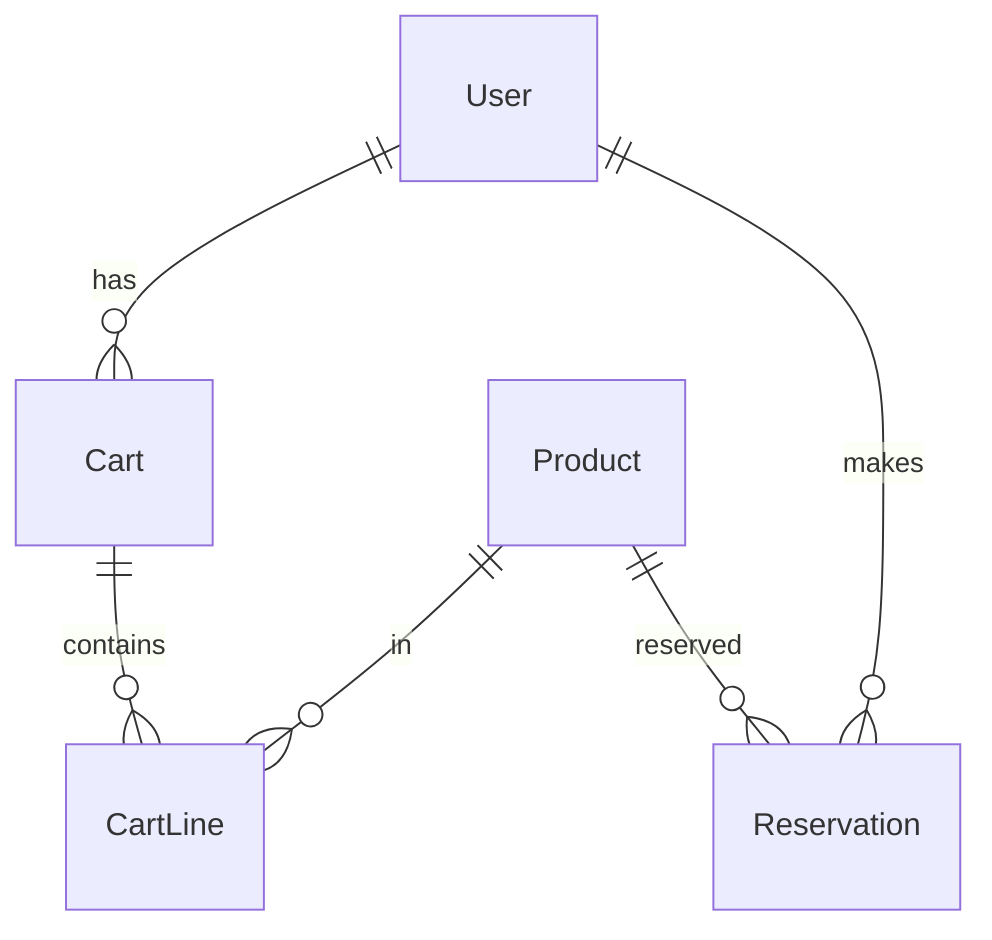

# Pet-Mart Backend Technical Documentation

## Table of Contents
1. [Technical Architecture](#technical-architecture)
2. [Core Technologies](#core-technologies)
3. [Database Design](#database-design)
4. [API Implementation](#api-implementation)
5. [Security Framework](#security-framework)
6. [Service Layer Architecture](#service-layer-architecture)
7. [Data Access Layer](#data-access-layer)
8. [Performance Optimizations](#performance-optimizations)
9. [Error Handling](#error-handling)
10. [Testing Strategy](#testing-strategy)

## Technical Architecture

### System Overview
```
[Client Layer] → [API Gateway] → [Application Layer] → [Data Access Layer] → [Database]
```

### Component Architecture
```
Backend/
├── src/main/java/
│   ├── config/                 # Configuration classes
│   ├── controllers/           # REST endpoints
│   ├── dto/                   # Data Transfer Objects
│   ├── entities/             # JPA entities
│   ├── exceptions/           # Custom exceptions
│   ├── repositories/         # Data access interfaces
│   ├── security/             # Security configuration
│   ├── services/             # Business logic
│   └── utils/                # Utility classes
```

## Core Technologies

### Spring Framework Components
1. **Spring Boot 2.7.x**
   - Auto-configuration
   - Embedded Tomcat server
   - Actuator for monitoring
   - Spring Boot DevTools

2. **Spring Security**
   - JWT-based authentication
   - Role-based authorization
   - Password encryption (BCrypt)
   - CORS configuration

3. **Spring Data JPA**
   - Repository pattern implementation
   - Custom query methods
   - Transaction management
   - Entity relationships

4. **Spring Validation**
   - Bean validation
   - Custom validators
   - Error message handling

### Database
- **MySQL 8.0**
  - InnoDB engine
  - UTF-8 character set
  - Indexed queries
  - Transaction support

### Build & Dependency Management
- **Maven**
  - Dependency management
  - Build lifecycle
  - Plugin configuration
  - Profile management

## Database Design

### Entity Relationships


### Optimized Schema
```sql
-- Users Table with Indexes
CREATE TABLE users (
    id BIGINT PRIMARY KEY AUTO_INCREMENT,
    first_name VARCHAR(50) NOT NULL,
    last_name VARCHAR(50) NOT NULL,
    email VARCHAR(100) NOT NULL,
    password VARCHAR(255) NOT NULL,
    role VARCHAR(20) NOT NULL,
    created_at TIMESTAMP DEFAULT CURRENT_TIMESTAMP,
    updated_at TIMESTAMP DEFAULT CURRENT_TIMESTAMP ON UPDATE CURRENT_TIMESTAMP,
    INDEX idx_email (email),
    INDEX idx_role (role)
) ENGINE=InnoDB DEFAULT CHARSET=utf8mb4 COLLATE=utf8mb4_unicode_ci;

-- Products Table with Full-Text Search
CREATE TABLE products (
    code VARCHAR(50) PRIMARY KEY,
    name VARCHAR(100) NOT NULL,
    type VARCHAR(50) NOT NULL,
    breed VARCHAR(50),
    age INT,
    price DECIMAL(10,2) NOT NULL,
    status VARCHAR(20) NOT NULL,
    image_path VARCHAR(255),
    description TEXT,
    created_at TIMESTAMP DEFAULT CURRENT_TIMESTAMP,
    updated_at TIMESTAMP DEFAULT CURRENT_TIMESTAMP ON UPDATE CURRENT_TIMESTAMP,
    INDEX idx_type (type),
    INDEX idx_status (status),
    FULLTEXT INDEX idx_search (name, breed, description)
) ENGINE=InnoDB DEFAULT CHARSET=utf8mb4 COLLATE=utf8mb4_unicode_ci;
```

## API Implementation

### RESTful Endpoints Architecture
```java
@RestController
@RequestMapping("/api/v1")
public class ProductController {
    @Autowired
    private ProductService productService;

    @GetMapping("/products")
    public ResponseEntity<Page<ProductDTO>> getProducts(
        @RequestParam(defaultValue = "0") int page,
        @RequestParam(defaultValue = "10") int size,
        @RequestParam(required = false) String type,
        @RequestParam(required = false) String status
    ) {
        return ResponseEntity.ok(productService.getProducts(page, size, type, status));
    }
}
```

### Response DTOs
```java
@Data
@Builder
public class ApiResponse<T> {
    private boolean success;
    private String message;
    private T data;
    private List<String> errors;
    private LocalDateTime timestamp;
}
```

### Exception Handling
```java
@ControllerAdvice
public class GlobalExceptionHandler {
    @ExceptionHandler(ResourceNotFoundException.class)
    public ResponseEntity<ApiResponse<Void>> handleResourceNotFoundException(
        ResourceNotFoundException ex
    ) {
        return ResponseEntity
            .status(HttpStatus.NOT_FOUND)
            .body(ApiResponse.<Void>builder()
                .success(false)
                .message(ex.getMessage())
                .timestamp(LocalDateTime.now())
                .build());
    }
}
```

## Security Framework

### JWT Implementation
```java
@Component
public class JwtTokenProvider {
    @Value("${jwt.secret}")
    private String jwtSecret;

    @Value("${jwt.expiration}")
    private long jwtExpiration;

    public String generateToken(Authentication authentication) {
        UserDetails userDetails = (UserDetails) authentication.getPrincipal();
        Date now = new Date();
        Date expiryDate = new Date(now.getTime() + jwtExpiration);

        return Jwts.builder()
            .setSubject(userDetails.getUsername())
            .setIssuedAt(now)
            .setExpiration(expiryDate)
            .signWith(SignatureAlgorithm.HS512, jwtSecret)
            .compact();
    }
}
```

### Security Configuration
```java
@Configuration
@EnableWebSecurity
public class SecurityConfig extends WebSecurityConfigurerAdapter {
    @Override
    protected void configure(HttpSecurity http) throws Exception {
        http
            .cors().and().csrf().disable()
            .sessionManagement()
            .sessionCreationPolicy(SessionCreationPolicy.STATELESS)
            .and()
            .authorizeRequests()
            .antMatchers("/api/auth/**").permitAll()
            .antMatchers("/api/products/**").permitAll()
            .antMatchers("/api/admin/**").hasRole("ADMIN")
            .anyRequest().authenticated()
            .and()
            .addFilterBefore(jwtAuthenticationFilter,
                UsernamePasswordAuthenticationFilter.class);
    }
}
```

## Service Layer Architecture

### Service Implementation Pattern
```java
@Service
@Transactional
public class ProductServiceImpl implements ProductService {
    @Autowired
    private ProductRepository productRepository;
    
    @Autowired
    private CacheManager cacheManager;

    @Override
    @Cacheable(value = "products", key = "#page + '-' + #size")
    public Page<ProductDTO> getProducts(int page, int size, String type, String status) {
        Pageable pageable = PageRequest.of(page, size, Sort.by("createdAt").descending());
        Specification<Product> spec = buildSpecification(type, status);
        return productRepository.findAll(spec, pageable)
            .map(this::convertToDTO);
    }
}
```

### Business Logic Implementation
```java
@Service
public class CartServiceImpl implements CartService {
    @Autowired
    private CartRepository cartRepository;
    
    @Autowired
    private ProductRepository productRepository;

    @Override
    @Transactional
    public CartDTO addToCart(String productCode, int quantity, Long userId) {
        Product product = productRepository.findByCode(productCode)
            .orElseThrow(() -> new ResourceNotFoundException("Product not found"));
            
        Cart cart = cartRepository.findByUserId(userId)
            .orElseGet(() -> createNewCart(userId));
            
        validateStock(product, quantity);
        updateCartItems(cart, product, quantity);
        
        return convertToDTO(cartRepository.save(cart));
    }
}
```

## Data Access Layer

### Repository Pattern
```java
@Repository
public interface ProductRepository extends JpaRepository<Product, String> {
    @Query("SELECT p FROM Product p WHERE p.type = :type AND p.status = 'AVAILABLE'")
    List<Product> findAvailableByType(@Param("type") String type);
    
    @Query(value = "SELECT * FROM products WHERE MATCH(name, breed, description) AGAINST(:searchTerm IN BOOLEAN MODE)",
           nativeQuery = true)
    Page<Product> searchProducts(@Param("searchTerm") String searchTerm, Pageable pageable);
}
```

### Query Optimization
```java
@Entity
@Table(name = "products")
@NamedQueries({
    @NamedQuery(
        name = "Product.findAvailableByType",
        query = "SELECT p FROM Product p WHERE p.type = :type AND p.status = 'AVAILABLE'"
    )
})
public class Product {
    // Entity implementation
}
```

## Performance Optimizations

### Caching Strategy
```java
@Configuration
@EnableCaching
public class CacheConfig {
    @Bean
    public CacheManager cacheManager() {
        CaffeineCacheManager cacheManager = new CaffeineCacheManager();
        cacheManager.setCaffeine(Caffeine.newBuilder()
            .expireAfterWrite(60, TimeUnit.MINUTES)
            .maximumSize(100));
        return cacheManager;
    }
}
```

### Database Optimizations
1. **Indexing Strategy**
   - Primary key indexes
   - Foreign key indexes
   - Composite indexes for common queries
   - Full-text search indexes

2. **Query Optimization**
   - Pagination implementation
   - Lazy loading for relationships
   - Eager loading for critical data
   - Query result caching

## Error Handling

### Custom Exceptions
```java
public class BusinessException extends RuntimeException {
    private final String errorCode;
    private final HttpStatus httpStatus;

    public BusinessException(String message, String errorCode, HttpStatus httpStatus) {
        super(message);
        this.errorCode = errorCode;
        this.httpStatus = httpStatus;
    }
}
```

### Error Response Structure
```json
{
    "timestamp": "2024-03-14T10:30:00",
    "status": 400,
    "error": "Bad Request",
    "code": "INVALID_INPUT",
    "message": "Invalid input parameters",
    "details": [
        "Product code cannot be empty",
        "Quantity must be greater than 0"
    ],
    "path": "/api/cart/add"
}
```

## Testing Strategy

### Unit Testing
```java
@SpringBootTest
class ProductServiceTest {
    @MockBean
    private ProductRepository productRepository;
    
    @Autowired
    private ProductService productService;

    @Test
    void whenGetProducts_thenReturnProductList() {
        // Test implementation
    }
}
```

### Integration Testing
```java
@SpringBootTest
@AutoConfigureMockMvc
class ProductControllerTest {
    @Autowired
    private MockMvc mockMvc;
    
    @Test
    void whenGetProducts_thenReturn200() throws Exception {
        mockMvc.perform(get("/api/products"))
            .andExpect(status().isOk())
            .andExpect(jsonPath("$.content").isArray());
    }
}
```

### Performance Testing
- JMeter test plans
- Load testing scenarios
- Stress testing parameters
- Performance benchmarks

## Monitoring and Logging

### Application Metrics
```java
@Configuration
public class MetricsConfig {
    @Bean
    public MeterRegistry meterRegistry() {
        return new SimpleMeterRegistry();
    }
}
```

### Logging Configuration
```properties
# Logging configuration
logging.level.root=INFO
logging.level.com.petmart=DEBUG
logging.pattern.console=%d{yyyy-MM-dd HH:mm:ss} [%thread] %-5level %logger{36} - %msg%n
```

## Deployment Architecture

### Containerization
```dockerfile
FROM openjdk:11-jre-slim
WORKDIR /app
COPY target/*.jar app.jar
EXPOSE 8080
ENTRYPOINT ["java", "-jar", "app.jar"]
```

### CI/CD Pipeline
```yaml
pipeline:
  stages:
    - build
    - test
    - deploy
  build:
    script:
      - mvn clean package
  test:
    script:
      - mvn test
  deploy:
    script:
      - docker build -t pet-mart .
      - docker push pet-mart
```

## Scalability Considerations

1. **Horizontal Scaling**
   - Stateless application design
   - Session management
   - Load balancing configuration

2. **Database Scaling**
   - Read replicas
   - Sharding strategy
   - Connection pooling

3. **Caching Strategy**
   - Distributed caching
   - Cache invalidation
   - Cache consistency

## Security Best Practices

1. **Input Validation**
   - Request validation
   - SQL injection prevention
   - XSS protection

2. **Authentication**
   - JWT token management
   - Password policies
   - Session management

3. **Authorization**
   - Role-based access control
   - Resource-level permissions
   - API endpoint security

## Future Technical Roadmap

1. **Architecture Improvements**
   - Microservices migration
   - Event-driven architecture
   - API gateway implementation

2. **Performance Enhancements**
   - Response time optimization
   - Database query optimization
   - Caching strategy refinement

3. **Security Enhancements**
   - OAuth2 implementation
   - API key management
   - Rate limiting 