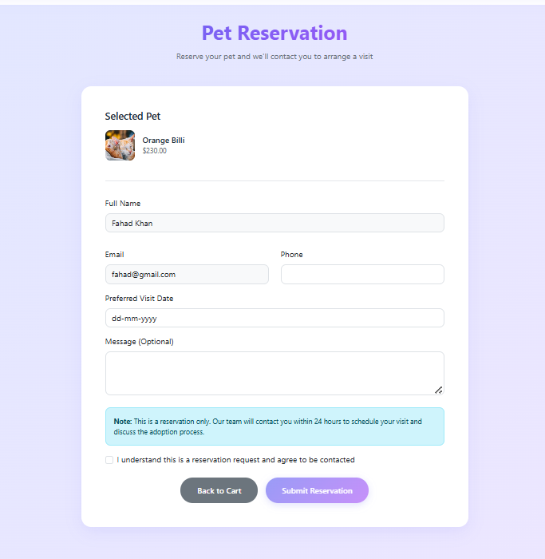

# Pet Mart - Pet Adoption Platform

## Overview

Pet Mart is a comprehensive pet adoption platform that connects potential pet owners with available pets. The platform features a user-friendly interface for browsing pets, managing reservations, and handling the adoption process.

## Features

- User authentication and authorization
- Browse available pets with detailed information
- Shopping cart functionality for pet reservations
- Reservation management system
- User profile management
- Admin dashboard for managing pets and reservations
- Responsive design for all devices

## Tech Stack

- **Frontend**: React.js, React Bootstrap, React Router
- **Backend**: Spring Boot, Spring Security
- **Database**: MySQL
- **Authentication**: JWT (JSON Web Tokens)

## Project Screenshots

### Homepage


The main landing page showcasing featured pets and navigation options.

### Pet List


Browse through available pets with filtering and search capabilities.

### Pet Details


Detailed view of each pet with comprehensive information and reservation options.

### Shopping Cart


Manage your pet reservations in the shopping cart.

### Reservation Form



Complete the reservation process with the user-friendly form.

### User Profile


View and manage your reservations and account information.

## Getting Started

### Prerequisites

- Java 17 or higher
- Node.js
- MySQL 8.0 or higher
- Maven

## Development

The project uses:

- Maven for backend dependency management
- npm for frontend package management
- Git for version control

## Installation

1. Navigate to the project root directory
2. Run the following command to install **both backend and frontend dependencies**:
   ```bash
   npm run install-all
   ```

## Running the Application

Start the development server using one of the following methods:

- **Option 1**: Run `npm run dev` in the command prompt (cmd). If this does not work, try the next option.
- **Option 2**: Run `start-dev.ps1` in PowerShell.

## License

This project is proprietary and confidential.
